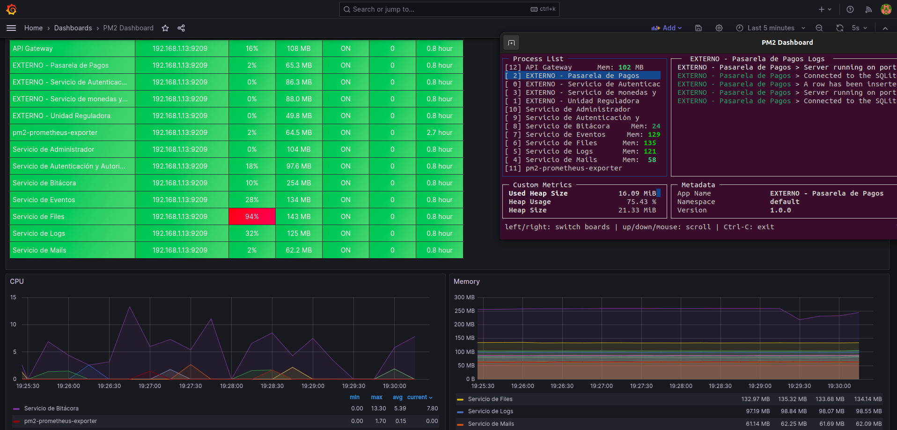

# 196991_182999

## Trabajo Obligatorio, Plataforma AureaUY

### Autores

- 196991 - Horacio Abalos
- 182999 - Federico Alonso

### Introducción

En el presente readme se proporcionarán las guías necesarias para las instalaciones y configuración de las aplicaciones. Así como principales aspectos de la misma.

### Documentación

El informe de arquitecura se encuentra en la carpeta Docs, se puede acceder a través del siguiente link:

[Documento de Arquitectura](./docs/Documento%20de%20Arquitectura.pdf)

En él se estudian 3 vistas principales:

- [Vista de Asignación](./docs/Vista%20de%20asignaci%C3%B3n.pdf)
- [Vista de componentes y conectores](./docs/Vista%20de%20componentes%20y%20conectores%20svc_evento.pdf)
- [Vista de módulos](./docs/Vista%20de%20m%C3%B3dulos.pdf)

### Estructura del Repositorio

El repositorio se encuentra dividido en 3 carpetas principales:

- **Code**: Contiene el código fuente de las aplicaciones.
- **Docs**: Contiene la documentación del proyecto.
- **DevOps**: Contiene los archivos necesarios para la configuración de la infraestructura.

Dentro de code tenemos cada aplicación en un directorio, con sus nombres correctamente especificados, y además hay una carpeta donde se encuentran las aplicaciones de los servicios externos que se usan.

### Infraestructura

Para el correcto funcionamiento se utilizan varias herramientas aparte de NodeJS, las cuales son:

- **Redis**: Base de datos en memoria para encolar los mensajes y cachear los datos de las consultas de los usuarios.
- **MongoDB**: Base de datos no relacional para almacenar los datos.
- **MySQL**: Base de datos relacional para almacenar los datos.

Opcional:

- **Prometheus**: Herramienta de monitoreo.
- **Grafana**: Herramienta de visualización de datos.

Todos estas herramientas se pueden crear con Docker, y se pueden configurar con Docker Compose. Tenemos un archivo en la carpeta DevOps que posee la configuración necesaria para levantar todos los servicios y con la configuración necesaria para que funcionen correctamente. Además se precargan datos en caso de ser necesarios, se crean bases de datos y se levantan las herramientas de monitoreo de cada servicio.

Cada servicio con docker tiene mapeado un volumen, por lo que una vez se empiecen a utilizar, los datos serán persistidos.

La única consideración es en caso de querer utilizar el monitoreo con Prometheus y Grafana, se debe correr el siguiente comando para que PM2 exponga las métricas:

```bash
pm2 install pm2-prometheus-exporter
```

En el archivo de configuración de Prometheus se debe colocar el IP privado del equipo:


Verificar que el firewall permita las conexiones entrantes al puerto 9206.

En Grafana configurar como Base de Datos Prometheus.

Cargar la plantilla de dashboards de PM2 que se encuentra en la carpeta DevOps.


### Configuración

Todos los servicios poseen una carpeta llamada conf y dentro de ella se encuentra un archivo config.json, el cual posee la configuración necesaria para el correcto funcionamiento de cada servicio.


### Instalación

Para que funcione correctamente, primero se deben instalar las dependencias, por lo que debemos recorrer los servicios y ejecutar el siguiente comando:

```bash
npm install
```

Postriormente se debe ejecutar el siguiente comando para que se levanten los servicios:

```bash
pm2 restart devops/ecosystem.config.js
```

Podemos monitorearlos tanto con Grafana como con el comando:

```bash
pm2 monit
```

Para que todos los días verifique si faltan menos de 168hs para que un evento no autorizado aún comience, y se informe a los administradores, se debe configurar el siguiente CronJob en el srvidor en el que se encuentra el servicio de eventos:

```bash
0 8 * * * curl http://localhost:4002/svc_evento/unauthorized
```

También se puede acceder como administrador a dicha ruta y se ejecutará el mismo proceso.

### Uso

Por la limitación de que se autentiquen contra un servicio externo, los usuarios que se pueden autenticar se encuentran en un archivo JSON en la carpeta de DevOps, llamado users.json.

Se encuentra un archivo en la carpeta DevOps con la colección de Postman utilizada para las pruevas, recuerden modificar los header de autorización.

Para demás consultas, se puede consultar la documentación de cada servicio en la carpeta Docs.

### Pruebas de Carga

Para probar el proyecto en carga, realizamos un script con K6, el cual se encuentra en la carpeta DevOps/tests, llamado get_events.js.

En el mismo se prueba la aplicación con 30 usuarios concurrentes, durante 60 segundos, pero las pruebas las fuimos realizando de manera paulatina para observar los resultados.

En las pruebas se ejecutan las consultas principales y el ver el video en cada iteración.


Podemos ver que al correr las pruebas en un principio para 25 usuarios por 30 segundos, el servicio de files tenía un pico de CPU.



Agregamos una instancia más y corremos nuevamente las pruebas:


Vemos un comportamiento similar con el servicio de eventos:


Luego de agregar una nueva instancia podemos ver que se recupera y distribuyen la carga:


Podemos ver una consulta luego, hecha por postman en la que se obtienen los eventos para el proveedor y el tiempo de respuesta de la misma es de 183 ms.


### Pruebas de Estrés

Ahora corremos las mismas pruebas pero esta vez para 30 usuarios concurrentes por 60 segundos, y obtenemos los siguientes resultados:

Antes de la prueba:


Durante la prueba:


Luego de la prueba podemos ver que los servicios se mantuvieron estables, durando un poco más el servicio de logs en recomponerse ya que debe terminar de loguear lo que tiene en la cola de Redis:


Presentamos los resultados de la prueba, teniendo la consulta más lenta 2.65s:


A continuación se muestra la cantidad de logs sobre la que se realizaron las pruebas, 59921:


### Complementos

Como complemento tenemos un enlace al tablero de Miro que se utilizó para la planificación del proyecto:

[Tablero Miro](https://miro.com/app/board/uXjVMIex_LY=/?share_link_id=974988375510)


#### Diagramas adicionales

Debido a la restricción en la extensión de la documentación se generan los siguientes diagramas que no se incluyen en ninguna vista:

- [Componentes y conectores svc_admin](./docs/diagramas%20no%20usados/Componentes%20y%20conectores%20svc-admin.jpg)
- [Componentes y conectores svc_file](./docs/diagramas%20no%20usados/Componentes%20y%20conectores%20svc_file.jpg)
- [Componentes y conectores bitacora](./docs/diagramas%20no%20usados/componentes%20y%20conectores%20bitacora.jpg)
- [Componentes y conectores svc_auth](./docs/diagramas%20no%20usados/componentes%20y%20conectores%20svc_auth.jpg)
